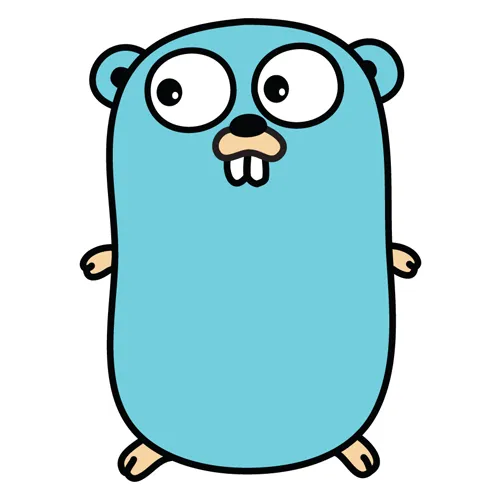

# Player Service
A simple golang service for storing and retrieving scores for given players. Credits to [Lean Go with Tests](https://quii.gitbook.io/learn-go-with-tests).

## Build
You can build the service by running:
```bash
go build
```

## Running the service
You can either run the compiled executable or use go tools:
```bash
go run .
```

## Running tests
You can run all the tests with:
```bash
go test ./...
```

